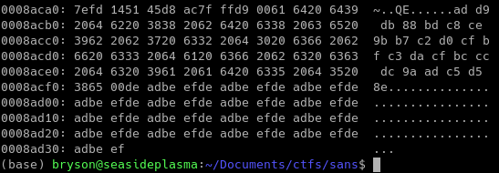
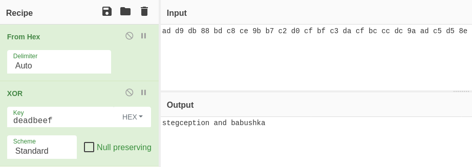
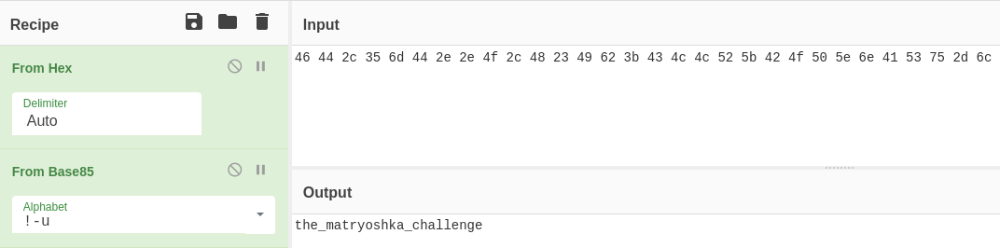

# FE06
## Forensics (Hard)

The provided zip file contains the following image:

There isn't much of interest in the image itself or its metadata, but there is some interesting data at the bottom of the file which can be seen using `xxd FE06.jpg`:

The ASCII-represented hexadecimal, **ad d9 db 88 bd c8 ce 9b b7 c2 d0 cf bf c3 da cf bc cc dc 9a ad c5 d5 8e**, caught my attention first, so that's where I started. Unfortunately, on their own these bytes don't appear do be interesting. However, the file also contains the bytes **de ad be ef**, repeated over and over. XOR-ing **deadbeef** with the bytes above yields the following:

Unfortunately, neither **stegception**, **babushka**, or **stegception and babushka** appear to be the flag. So there is more work to be done! After some experimentation I found that a file had been embedded in the image using "babushka" as the password. The file, flag.zip, can be extracted using the command `steghide extract -sf FE06.jpg -p babushka`. The zip file itself is also password protected, using the other half of the password. It can be unlocked using `unzip -P stegception flag.zip`.

Even after all that work, the flag doesn't present itself. Instead, the zip file provides a single file, **flag.txt**, containing the following:

**46 44 2c 35 6d 44 2e 2e 4f 2c 48 23 49 62 3b 43 4c 4c 52 5b 42 4f 50 5e 6e 41 53 75 2d 6c**

The bytes are all ASCII characters, but don't appear to represent anything meaningful. After some experimentation, I found that it was a base85 representation of the flag:

